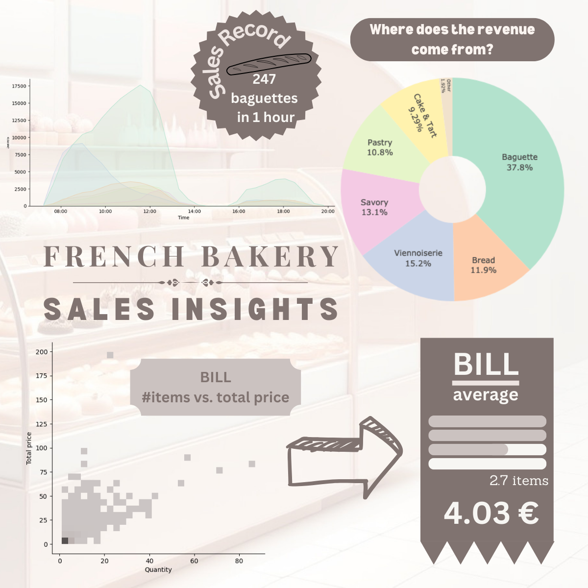

# French Bakery Sales Analysis

## Overview

The goal of this project is to practice data analysis and visualizations around a new dataset. I choose the French Bakery Sales dataset because I was interested in, and see what I could learn about this.

## Data

This data comes from kaggle (https://www.kaggle.com/datasets/matthieugimbert/french-bakery-daily-sales/data).
The dataset belongs to a French bakery. The dataset provides the daily transaction details of customers from 2021-01-01 to 2022-09-30.
I computed an other file to map article (item) and a logical category.

### Data Description

The attributes of this data set include:
- date: date order
- time: time order
- ticket number: identifier for every single transaction
- article: name of the product sold (in French)
- quantity: quantity sold
- unit_price: price per product

## Data prepocessing and cleaning

Here are the operations I made on the data to get a cleaned and usable dataset:
- Transformation of the types (date and time, unit_price)
- Deletion of duplicates and null price
- Isolation of refunds (negative transactions) and their associated initial transactions
- Add category, weekday, month and total_price

## Summary of Findings

### profile during time of day
- No sales between 2:30pm and 3:30pm. Maybe the bakery is closed during this time.
- Most of the sales are done during the morning or between 4:30pm-6:30pm
- We can observe trends according to the categories of sold items

### profile during week of day
- Obviously more sales during the weekend
- Bigger increase for the cakes, tarts and pastry during the weekend too

### profile during months of the year
- We can observe a bigger revenue during the summer months (July and August). These months are the vacations months for French people. Like any non working day, French people are eating more bakery items during the summer days. But the bakery may be also open while others in the same neighborhood are closed so they may take part of their revenue.

### revenue distribution per category
- Baguette represents 38% of the global revenue in that bakery

### bill analysis
- The average bill is 2.6 items for 4 euros which is relatively cheap compared to the price in USA where only 1 baguette costs $4 !
- The max total price is 199.70 euros and the max number of items in one purchase is 87.

## More to come
An analysis on the refunds is possible

## Notebooks

- [Jupyter Notebook](./main_notebook.ipynb): A detailed exploration and analysis of the data.
